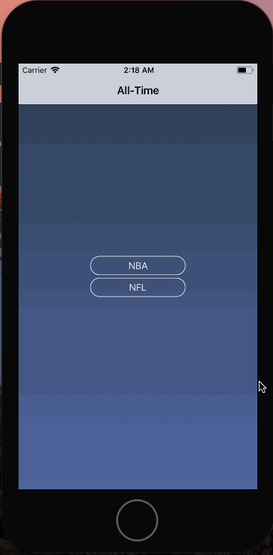

# All-Time

## Problem
Most sports apps today give you scores, player profiles, stats for the current season, etc. For some sports fans, it's fun to check out the statistical leaders in the history of the league. Sure, you can open a web browser and search the stats yourself, but what if you had an app that gives you the stats for multiple leagues?

## Solution
**All-Time** is an app that displays the top-20 statistical leaders of a certain category of a league.

## Preview

*More leagues will be added* 